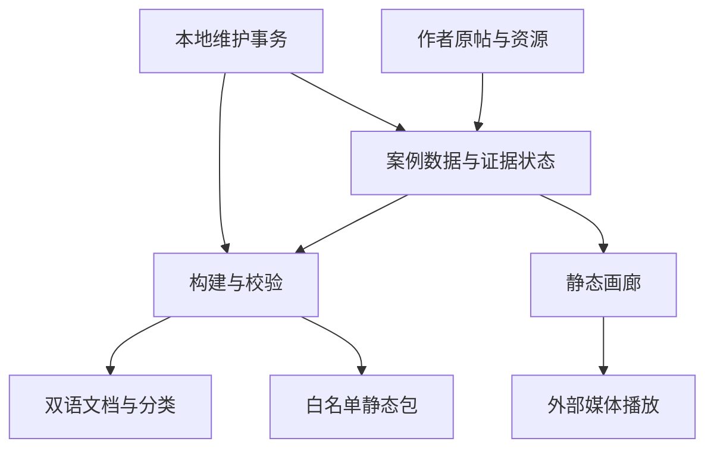

# 项目架构与设计经验

[返回入口](README.md)

## 实际边界

上游把 X 原帖作品组织成一个可浏览、可纠错的证据目录。数据源是 `data/cases.json`，不是原片工程。581 条案例横跨代码绘制、生成式视频、实时 3D、交互游戏和剪辑工作流；不能把目录中的全部作品称为同一种“纯代码动画”。

## 数据模型的学习价值

| 字段 | 作用 | 容易误读的地方 |
|---|---|---|
| `source` / `author` | 主帖、发布时间与作者署名 | 回复与转载不能代替主帖身份 |
| `model` | 作者声明及依据 | 名字不是独立性能测试结论 |
| `prompt.status` | original / brief / unknown | 任务转述不能升级成原始指令 |
| `prompt.display` | 内联或 source_link | 有入口不意味着公开完整对话 |
| `stage` | discovery / catalogued | 编目完成不是完整片质量通过 |
| `verification` | 来源、完整审看、复现等独立状态 | 头部响应通过不能填 fullReview |
| `resources` | code / demo / tool 与许可 | 工具模板和产品仓库不是案例完整工程 |
| `metrics` | 原帖互动快照 | null 与 0 分开；收藏量不是质量评级 |
| `review` | 人工精选、优点、排后 | 独立于来源核对与收藏排序 |
| `webPlayback` | 已匹配原帖的外部视频 | 不是重新上传授权；一条主播放地址不代表所有附件 |

对汤圆项目而言，这种分离很重要：资料已找到、音频已确认、画面已渲染、实际看过、用户认可、规则可推广，应分别记录。否则技术通过会被误报为创作通过。

## 构建与前端

`build.mjs` 校验数据，再生成两种语言的 README、类别、案例和提示词导出。它验证 HTTPS、帖子与作者对应、资源类型、许可标签、提示词显示策略及媒体 URL；嵌套代码围栏和 Markdown 转义防止作者文字破坏生成格式。`--check` 重建结果与文件比较，可以发现手工改页面与事实源脱节。

画廊采用原生 DOM 与同一份 JSON。`gallery-model.mjs` 把筛选、排序、URL 状态和相关作品选择从 UI 中抽出来；列表每批 36 条，但详情前后切换使用完整筛选集合，避免只在可见卡片中导航。未知收藏数排在实际 0 之后，人工评价不会偷偷改收藏快照顺序。

`gallery.mjs` 处理焦点、历史、关闭详情后的滚动恢复、分享直达以及视频超时／有限重试。分享首次进入保留用户播放决定；外部 MP4 失效时回到作者原帖。页面文字以安全文本方式插入；脚本不负责重建视频，也不进行视觉质量判断。

## 本地维护与发布

`serve.mjs` 仅绑定 127.0.0.1，静态路径白名单、真实路径校验及会话令牌把维护接口和公开站点分开。`curation.mjs` 用数据版本防止过期写入；修改前检查生成文件是否存在人工变化；删除／恢复／评价由事务日志串起数据、双语页面、提示词和封面，失败回滚，重启恢复未完成事务。

`package-site.mjs` 先检查所有引用，再按白名单输出 586 个站点文件，不带 Git、原始研究、维护 API 或视频。独立标记防止把任意目录当打包结果覆盖。GitHub Pages 工作流只在指定正式仓库 main 发布，先测试、生成一致性、公开范围与目标检查，再上传站点。每日媒体检查报告异常，不自动删作品。

## 可以借鉴的五项工程习惯

1. 单一事实源生成所有对外入口，避免音频表、字幕表和镜头表各自复制时间。
2. 空值保留空值；无法核对就写未知，而不是用推测补齐展示。
3. 状态与评级分开，播放可用、来源可信和创作优秀分别验收。
4. 修改采用版本保护和可恢复事务，保留最后一版可用结果。
5. 发布只带交付所需内容，研究原始响应和第三方媒体不混进成品。

对应源码入口和逐文件记录见 [02_FULL_FILE_REVIEW.md](02_FULL_FILE_REVIEW.md)。
